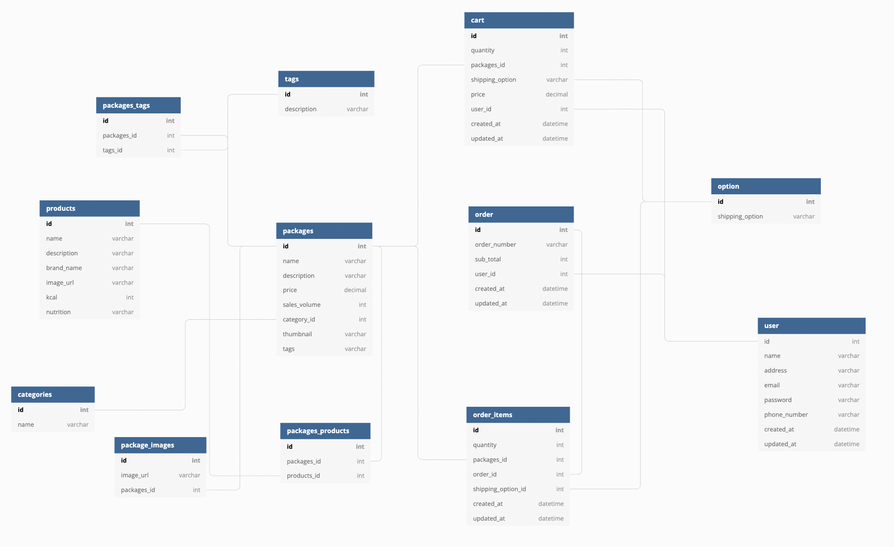

# 27-1st-BAGETTT-backend
> GETTT(https://www.gettt.com/)는 패션, 생활용품, 가구 등을 판매하고 장, 단기 렌탈 서비스를 제공하는 비즈니스입니다.
> 바게트라는 프로젝트명으로 전국의 유명한 베이커리의 빵을 담은 패키지를 구성하여 주 1회 정기배송하는 서비스로 기획하였습니다.

 

## 개발인원 및 기간
- 개발기간 : 2021-11-29 ~ 2021-12-10
- Front-end : (https://github.com/wecode-bootcamp-korea/27-1st-bagettt-frontend)
- Back-end : 김은혜, 이재문
  김은혜 : ERD/Modeling, API Document, Database, PackagesList(filter) & ProductsDetailView, CartView(POST, GET, DELETE, PATCH)
  이재문 : ERD/Modeling, LogIn & SignUpView(인가 Decorator, 값 검증 Validator), OrderView

## 협업 도구
- Slack
- Github
- Trello
- Notion

## 적용 기술
Python, Django, MySQL, Bcrypt, JWT, AWS(EC2, RDS, Git)

## 구현 기능

### User
- Sign-Up : 정규표현식을 사용한 email, password 검증 validator
- bcrypt : 비밀번호 암호화
- 로그인시 JWT 토큰 발행 및 토큰 검사

### Product & detail 
- 제품(packages) 목록 조회
- 조건(브랜드명, 가격순)별 조회 : 중복검색기능

### Cart
- 장바구니 담기 및 보기, 삭제(부분삭제, 전체삭제), 장바구니 수량 및 가격 실시간 반영

### Order
- 주문 완료 내역 출력
- 장바구니와 주문 완료된 제품 사이의 ACID 수행을 위한 Transaction 기능 활용

## ERD

## Reference
- API Document(https://docs.google.com/spreadsheets/d/1LvlwsQ6QJSQ0f5bkeS_LluSu8xF7KqAE3olJOh2dAT8/edit?usp=sharing)
- 이 프로젝트는 [**GETTT**](https://www.gettt.com/) 사이트를 참조하여 학습목적으로 만들었습니다.
- 실무 수준의 프로젝트이지만 학습용으로 만들었기 때문에 이 코드를 활용하여 이득을 취하거나 무단 배포할 경우 법적으로 문제가 될 수 있습니다.
- 이 프로젝트에서 사용하고 있는 사진 대부분은 위코드에서 구매한 것이므로 해당 프로젝트 외부인이 사용할 수 없습니다.
